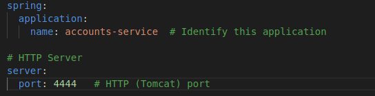
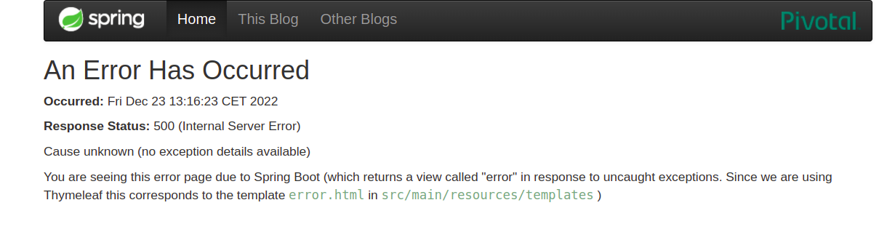

# REPORT
## Steps required
The objective is to show that the following activities have been accomplished:
- The two services `accounts (2222)` and `web` are running and registered (two terminals, logs screenshots).
- The service registration service has these two services registered (a third terminal, dashboard screenshots)
- A second `accounts` service instance is started and will use the port 4444. This second `accounts (4444)` is also
  registered (a fourth terminal, log screenshots).
- What happens when you kill the service `accounts (2222)` and do requests to `web`?  
  Can the web service provide information about the accounts again? Why?
 
  
### Accounts and web services running and registered
- First, I launch the registration service with 
 ```bash
  ./gradlew registration:bootRun
  ```
  The discovery server is launched, as shown in the screenshot below:
 


- After that, I launch the first accounts service with 
```bash
  ./gradlew accounts:bootRun
  ```
  It launches correctly, as you can see in the screenshot below:
  
  
  
  And it appears in Eureka's Dashboard
  
   
   
   - After that, I launch the web service with 
```bash
  ./gradlew web:bootRun
  ```
  It launches correctly, as you can see in the screenshot below:
  
  
  
  And it also appears in Eureka's Dashboard
  
   
   
 - Then I modify the accounts/src/main/resources/application.yaml. As shown in the next screenshot, I change the port form 2222 to 4444 as requested:

  
  
 - Next step is to launch another accounts service:
 
  
  
  Which also appears in Eureka's dashboard:
  
  
  
  - After that we need to kill the account service running on port 2222, and we do so with Ctrl+C
  - It's notified in Eureka's dashboard

  
  
  - So when I try to connect with the accounts there is an error
  
   
   
   - But after waiting for some time (15 seconds more or less) and trying to connect again, the web service is able provide information about the account again.

   
   
   - The explanation to this is that, even though the accounts service is not running anymore on port 2222, it still runs on port 4444 so the web service is still able to find the account service (after some time) and use it.

